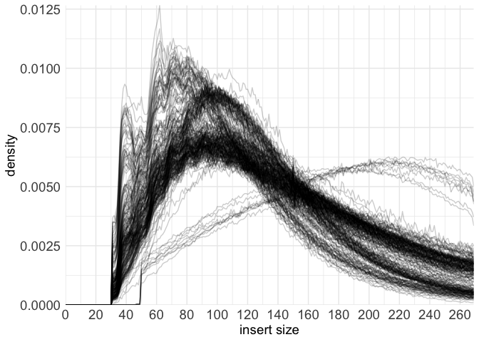

# Code for supplementary note 2: Outlier soil samples


Raphael Eisenhofer 2024

### Import smf/STAT estimates

``` r
library(tidyverse)
library(janitor)
library(gghighlight)

setwd("../")

## load smf/STAT estimates
curated_metadata <- read_delim("data/sra/curated_metadata.tsv.gz")
mmdb <- read_delim("data/sra/marmdb_selected_dataset_all_col_20231103_134849.csv.gz")
acc_organism <- read_delim("data/sra/acc_organism.csv.gz")
ncbi_method <- read_delim("data/sra/NCBI_method_taxonomy_processed.csv.gz")
meta_data_extra <- read_delim("data/sra/extra_metadata_short.tsv.gz") %>%
  clean_names()
singlem_method <- read_delim("data/sra/sra126_r214_mach2.condense.read_fraction6.in_sandpiper.csv.gz",
                             col_names = c("acc", "estimated_bases", "total_bases", "singlem_percent", "warning")) %>%
  mutate(singlem_percent = as.numeric(sub("%", "", singlem_percent))) %>%
  inner_join(., meta_data_extra, by = join_by(acc == run))

## Load and filter datasets
merged <- acc_organism %>%
  inner_join(., ncbi_method, by = "acc") %>%
  inner_join(., singlem_method, by = "acc") %>%
  clean_names() %>%
  mutate(ncbi_stat = microbial_fraction * 100)

## filter only WGS, RANDOM selection, and samples with > 0.5 Gbp
merged_filtered <- merged %>%
  filter(library_strategy == "WGS" & library_selection == "RANDOM") %>%
  filter(gbp > 0.5) %>%
  filter(!is.na(ncbi_stat))

## setup theme for figures
theme_re <- theme(
  axis.text = element_text(size = 16),
  axis.title = element_text(size = 18),
)
```

### Outliers from figure 4

We noticed that there were some outliers from the soil samples in figure
4, namely, samples that had higher STAT values than SMF (see point for
STAT \> 25 and SMF \< 50 below).

``` r
merged_filtered %>%
  filter(organism == "soil metagenome") %>%
  ggplot(aes(y = singlem_percent, x = ncbi_stat)) +
  geom_point() +
  scale_x_continuous(limits = c(0, 100)) +
  scale_y_continuous(limits = c(0, 100)) +
  theme_minimal() + 
  theme_re
```


### What studies do these outlier samples come from?

``` r
outliers <- merged_filtered %>%
  filter(organism == "soil metagenome") %>%
  filter(singlem_percent < 50 & ncbi_stat > 25) 

outliers %>%
  summarise(n = n(), .by = bioproject_x) %>%
  arrange(desc(n))
```

    # A tibble: 15 × 2
       bioproject_x     n
       <chr>        <int>
     1 PRJNA554847     91
     2 PRJNA671703     78
     3 PRJNA509545      6
     4 PRJEB18701       5
     5 PRJEB23737       4
     6 PRJNA298972      3
     7 PRJNA443200      2
     8 PRJNA443203      2
     9 PRJNA767554      2
    10 PRJNA665391      2
    11 PRJNA682830      1
    12 PRJNA320198      1
    13 PRJNA445060      1
    14 PRJNA471816      1
    15 PRJNA443182      1

``` r
top2_outliers <- outliers %>%
  summarise(n = n(), .by = bioproject_x) %>%
  arrange(desc(n)) %>%
  slice(1:2)
  
top2_outliers_samples <- outliers %>%
  filter(bioproject_x %in% top2_outliers$bioproject_x) 

prop_top2 <- scales::percent(nrow(top2_outliers_samples) / nrow(outliers), accuracy = 0.1)
```

There are 200 of these outlier samples, and two bioprojects PRJNA554847,
PRJNA671703 account for 84.5% of the total. What’s common about these
two projects? Well, going to the original papers, they both used a
modified nextera library prep method described here:
<https://www.ncbi.nlm.nih.gov/pmc/articles/PMC4441430/> .

In this protocol, the authors state:

> We found that the distribution of fragment sizes depends mainly on
> three parameters: (1) the input concentration of gDNA during
> tagmentation; (2) the PCR extension time; and (3) the amount of beads
> during post-PCR clean-up.

They also suggest:

> When using a novel DNA source or extraction method, we strongly
> recommend calibrating the first and the third parameters by dilution
> series on a representative sample

So we could hypothesise that something went wrong in the library
preparation for these outlier samples. If the insert size is too short,
this could result in a couple of scenarios:

**1) SMF underestimates**

Because SingleM searches for 20 amino acid (60 bp) sequences, short
insert sizes would negatively impact SingleM’s ability to classify
single-copy core genes

**2) Adapter sequences are classified as bacterial by STAT**

If the insert size of a library is too short, adapter/indexing sequences
can be sequenced, which, if not removed, could be classified as
bacterial by STAT.

**2)** would be too difficult for us to demonstrate, so we will focus on
**1).**

### Visualising these two bioprojects

First, lets see if all samples from these two outlier bioprojects have
issues, or whether it’s only a subset of the samples.

``` r
merged_filtered %>%
  filter(organism == "soil metagenome") %>%
  ggplot(aes(y = singlem_percent, x = ncbi_stat, colour = bioproject_x)) +
  geom_point() +
  gghighlight(bioproject_x %in% top2_outliers$bioproject_x, 
              label_key = type) +
  scale_x_continuous(limits = c(0, 100)) +
  scale_y_continuous(limits = c(0, 100)) +
  theme_minimal() + 
  theme_re
```


Looks like a small subset of the samples from `PRJNA554847` lie within
the main cloud of points.

Now, let’s download these samples and calculate the insert sizes to see
if this correlates with the outlier samples.

### Calculate insert sizes from these bioprojects

Using BASH here:

``` bash
#Using kingfisher to download samples
mkdir data/insert_sizes && cd data/insert_sizes

kingfisher get -p PRJNA554847 -m prefetch --download-threads 8
kingfisher get -p PRJNA671703 -m prefetch --download-threads 8

pigz -p 16 *.fastq

#Use fastp to calculate insert sizes
for i in *_1.fastq.gz; 
  do fastp -i $i \
  -I ${i/_1.fastq/_2.fastq} \
  -j ${i/_1.fastq.gz/.json} \
  -h ${i/_1.fastq.gz/.html} \
  -w 8;
done

#Collect insert sizes from json files, save as .csv files
for i in *.json; 
  do grep 'histogram' $i | cut -f2 -d "[" | sed 's/]//' | sed "s@0@${i/.json/},0@" > ${i/.json/.csv}; 
done
```

### Correlations between insert size and SMF/STAT estimates

``` r
#import insert sizes into a long dataframe
insert_files <- list.files(path = "../data/insert_sizes/", 
                           pattern = "*.csv",
                           full.names = T)

import_inserts <- function(x){
  read_csv(x, col_names = c("sample_id", seq(0, 269))) %>%
    select(!starts_with("X")) %>%
    pivot_longer(cols = !sample_id, 
                 values_to = "reads",
                 names_to = "bp")
}

insert_df <- map(insert_files, import_inserts) %>% 
  bind_rows() %>%
  transform(bp = as.numeric(bp)) %>%
  as_tibble() %>%
  mutate(percent = reads / sum(reads), .by = sample_id)


#plot for each sample
insert_df %>%
  ggplot(aes(x = bp, y = percent, group = sample_id)) +
  geom_line(alpha = 0.2) +
  scale_x_continuous(breaks = seq(0, 270, 20)) +
  coord_cartesian(expand = F) +
  theme_minimal() +
  theme(axis.text = element_text(size = 14),
        axis.title = element_text(size = 14)) +
  labs(x = "insert size", y = "density")
```



``` r
#calculate mode per sample 
modes <- insert_df %>%
  mutate(max = max(reads), .by = sample_id) %>%
  filter(reads == max(reads), .by = sample_id) %>%
  rename(mode = bp)

#combine with smf/stat values
merged_projects <- merged_filtered %>%
  filter(bioproject_x %in% top2_outliers$bioproject_x) %>%
  left_join(., modes, by = join_by("acc" == "sample_id")) %>%
  filter(!is.na(mode))

merged_projects %>%
  ggplot(aes(y = singlem_percent, x = mode, 
             colour = bioproject_x)) +
  geom_point() +
  theme_minimal() + 
  theme_re
```


``` r
median_insert <- median(merged_projects$mode)
mean_insert <- mean(merged_projects$mode)
sd_insert <- sd(merged_projects$mode)
median_soil_stat <- scales::number(median(merged_filtered %>% 
                           filter(organism == "soil metagenome") %>% 
                           pull(ncbi_stat)),
                           accuracy = 0.01)
median_outlier_stat <- scales::number(median(merged_projects$ncbi_stat), accuracy = 0.01)
```

Most samples for these two bioprojects have very short insert sizes
median = 92; mean = 94.0243902; +- 23.2929746. These two outlier
bioprojects have some of the highest STAT values for all soil samples:
median STAT for all soil samples = 6.12%, median for outlier bioprojects
= 40.27%. These short insert sizes could support the idea **2)** that
STAT is misclassifying adapter sequences as bacterial, however, this is
beyond the scope of exploring with this dataset.

These results support idea **1)**, that short insert sizes negatively
impact SMF estimates, as we can see in the figure for samples that have
insert sizes \< 75 bp.

### Conclusions

From this analysis, I’m pretty convinced that we’ve gotten to the bottom
of why we see odd outliers from the publicly available soil metagenomic
samples from Figure 4. Namely, the library preparation conducted in
these studies wasn’t calibrated for input DNA concentrations, resulting
in insert sizes that were too short.

We can’t prove that **2) Adapter sequences are classified as bacterial
by STAT** is happening without exhaustively checking insert sizes from
all the other thousands of metagenomes, or looking into the source code
of STAT. However, the results support the idea **1)** that SMF is
sensitive to short insert sizes in libraries.

I can actually see some positives from this. If you’re looking to use
publicly available data, SMF estimates that are lower than the usual
mean for a sample type (e.g. 70% for soil samples) can act as a soft
warning that something could be wrong with the underlying samples. This
could prompt researchers to further investigate those samples, and check
whether the insert sizes are as they should be. If not, a likely reason
would be issues during the sample(s) library preparation.
